# ARCHITECTURE.md — معماری و مدل دادهٔ پروژهٔ امیت (فاز ۱)

**وضعیت سند:** مرجع معماری و مدل دادهٔ مصوب فاز ۱؛ پیاده‌سازی در فازهای بعد طبق ADRها تکمیل شده است.
**ورودی این سند:** `DISCOVERY.md` (تصمیمات بنیادین فاز ۰) + پاسخ‌های مالک محصول به سؤالات فاز ۱
**خروجی اولیه:** این فایل + ERD (بخش ۴) + ۱۰ ADR در `docs/adr/`
**یادداشت وضعیت:** این سند طراحی اولیه را نگه می‌دارد؛ تغییرات پذیرفته‌شدهٔ بعدی، از جمله scope نهایی AI، در `ADR-0026` و `CHANGELOG.md` ثبت شده‌اند.

---

## ۰. تصمیمات ورودی از فاز ۱ (پاسخ‌های مالک محصول)

| موضوع | تصمیم |
|---|---|
| روش احراز هویت | ایمیل + رمز عبور (استاندارد Django)؛ بدون OTP برای ورود در فاز اول |
| استراتژی i18n محتوا | `django-modeltranslation` |
| موجودیت Translation عمومی | بله، لازم است (جدول key-value قابل‌ویرایش در ادمین) |
| رابطهٔ Contact/Lead | جدا از هم — Contact = ثبت خام فرم، Lead = پایپ‌لاین فروش با وضعیت |
| سیاست کامنت‌گذاری | فقط کاربر واردشده + تأیید ادمین قبل از انتشار |
| دسترسی به دوره‌های Academy | محتوای آزاد و عمومی در فاز اول؛ بدون مدل Enrollment |

این تصمیمات مستقیماً در مدل داده و ADRهای زیر اعمال شده‌اند.

---

## ۱. نمای کلی معماری سیستم

```
┌──────────────────────────┐        HTTPS/JSON         ┌───────────────────────────┐
│   Next.js (SSR) Frontend │ ─────────────────────────▶ │   Django + DRF API (v1)   │
│   apps/web (frontend/)   │ ◀───────────────────────── │   backend/                │
│   - صفحات fa (/) و en(/en)│        REST + OpenAPI      │   - Modular Monolith apps │
│   - i18n روتینگ + SEO    │                             │   - ai_engine (Guardrail) │
└──────────────────────────┘                             └──────────┬────────────────┘
                                                                     │
                                                         ┌───────────┴───────────┐
                                                         │  SQLite (dev)          │
                                                         │  MySQL 8 (production)  │
                                                         └────────────────────────┘
```

- فرانت‌اند (Next.js) و بک‌اند (Django/DRF) در یک **مونو-ریپو** نگه‌داری می‌شوند (`backend/`, `frontend/`) — ر.ک. `ADR-0001`.
- بک‌اند یک **Modular Monolith** است: یک پروژهٔ Django با چند اپ مستقل دامنه‌محور، نه میکروسرویس — ر.ک. `ADR-0002`.
- تمام فیچرهای هوش مصنوعی صرفاً از طریق اپ `ai_engine` و با ورودی Enum بسته انجام می‌شود (قانون ۱۲/۱۳/۱۴) — ر.ک. `ADR-0009`.
- روی هاست cPanel: دو پردازهٔ جدا (Django از طریق Passenger WSGI، Next.js از طریق Passenger Node.js App) پشت یک دامنه با reverse-proxy/subpath تنظیم می‌شوند؛ جزئیات دیپلوی در فاز بعدی (Deployment) مستند خواهد شد.

---

## ۲. ساختار اپ‌های Django (Modular Monolith)

```
backend/
├── manage.py
├── requirements.txt            # وابستگی‌های production
├── requirements-dev.txt        # + ابزارهای توسعه (pytest, mypy, ruff, ...)
├── config/                     # تنظیمات پروژه (نه یک «اپ» دامنه‌ای)
│   ├── settings/
│   │   ├── base.py             # مشترک
│   │   ├── dev.py              # SQLite, DEBUG=True
│   │   └── production.py       # MySQL, امنیت سخت‌گیرانه
│   ├── urls.py                 # ریشهٔ URLconf (شامل /api/v1/, /admin/, /sitemap.xml, ...)
│   ├── wsgi.py / asgi.py
│   └── celery.py (در صورت نیاز آینده؛ خالی/غیرفعال در فاز اول طبق ADR-0006)
└── apps/
    ├── core/          # زیرساخت مشترک: Mixinها، Media، Translation، AuditLog، SiteSettings
    ├── accounts/      # User سفارشی، Profile، احراز هویت
    ├── taxonomy/      # Category، Tag (قابل استفادهٔ مشترک بین چند اپ)
    ├── company/       # TeamMember، Testimonial (محتوای صفحهٔ About)
    ├── services/      # Service (صفحهٔ Services)
    ├── portfolio/     # Project، CaseStudy (صفحهٔ Projects/Pentestor/CRM)
    ├── academy/       # Course، Lesson، Instructor
    ├── blog/          # BlogPost، Comment (صفحهٔ Library)
    ├── leads/         # Contact، Lead، Newsletter
    ├── ai_engine/     # AIRequest، AISuggestion، GuardrailRule، PromptTemplate
    └── api/           # لایهٔ ترکیب: روتر DRF v1 + تنظیمات drf-spectacular (OpenAPI)
```

**قاعدهٔ مرزبندی:** هر اپ دامنه‌ای شامل `models.py`, `admin.py`, `serializers.py`, `views.py`/`viewsets.py`, `urls.py`, `services.py` (منطق کسب‌وکار خارج از view/serializer)، `translation.py` (ثبت فیلدهای مدل‌ترنسلیشن)، و `tests/` خودش است. اپ `api` هیچ مدلی ندارد و فقط URLها/روترهای اپ‌های دیگر را زیر `/api/v1/` ترکیب می‌کند. دلیل و جایگزین‌های بررسی‌شده در `ADR-0002`.

---

## ۳. فهرست کامل موجودیت‌ها به تفکیک اپ

> نماد `[i18n]` یعنی فیلد توسط `django-modeltranslation` به دو ستون `_fa`/`_en` تبدیل می‌شود. نماد `[public_id]` یعنی مدل علاوه بر PK عددی داخلی، یک `UUIDField` منتشرشونده به API عمومی دارد (جلوگیری از IDOR/حدس شناسه — رجوع به ADR-0007).

### ۳.۱ اپ `core`

| مدل | فیلدهای کلیدی | توضیح |
|---|---|---|
| `TimeStampedModel` *(abstract)* | `created_at`, `updated_at` | پایهٔ همهٔ مدل‌ها |
| `PublishableModel` *(abstract)* | `status` (draft/published/archived), `published_at` | کنترل انتشار محتوا |
| `SEOMetaModel` *(abstract)* | `meta_title[i18n]`, `meta_description[i18n]`, `og_image→Media`, `canonical_path` | رجوع به قانون ۱۷ |
| `SiteSettings` *(singleton)* | `site_name[i18n]`, `default_locale`, `contact_email`, `contact_phone`, `social_links (JSON)`, `maintenance_mode` | تنظیمات سراسری قابل‌ویرایش در ادمین |
| `Media` | `file`, `media_type` (image/document/video), `alt_text[i18n]`, `caption[i18n]`, `width`, `height`, `file_size`, `mime_type`, `checksum`, `uploaded_by→User` | منبع مرکزی فایل برای همهٔ اپ‌ها (ADR-0005) |
| `Translation` | `namespace`, `key`, `locale`, `value` (text), `is_html` (bool), `updated_by→User`, `updated_at` | رشته‌های پویای قابل‌ویرایش در ادمین، مکمل gettext (ADR-0003)؛ `unique_together=(namespace, key, locale)` |
| `AuditLog` | `actor→User` (nullable)، `action`، `target_content_type` + `target_object_id` (GenericForeignKey)، `metadata (JSON)`، `ip_address`، `user_agent`، `created_at` | رجوع به قانون ۱۶ |

### ۳.۲ اپ `accounts`

| مدل | فیلدهای کلیدی | توضیح |
|---|---|---|
| `User` *(AbstractUser سفارشی)* | `email` (USERNAME_FIELD, unique)، `phone` (nullable، برای اعلان پیامکی بعدی)، `role` (admin/editor/student/client)، `is_phone_verified` | ایمیل+رمز طبق تصمیم فاز۱؛ `phone` برای توسعهٔ آیندهٔ Kavenegar نگه داشته می‌شود |
| `Profile` | `user→User (OneToOne)`، `avatar→Media`، `bio[i18n]`، `locale_preference` (fa/en)، `job_title[i18n]`، `company_name` | اطلاعات تکمیلی |

### ۳.۳ اپ `taxonomy`

| مدل | فیلدهای کلیدی | توضیح |
|---|---|---|
| `Category` `[public_id]` | `name[i18n]`، `slug`، `parent→self` (nullable)، `scope` (choices: blog/academy/portfolio/service — محدودکنندهٔ کاربرد) | دسته‌بندی سلسله‌مراتبی قابل‌استفادهٔ مشترک |
| `Tag` | `name[i18n]`، `slug` | برچسب تخت، M2M از چند اپ |

### ۳.۴ اپ `company`

| مدل | فیلدهای کلیدی | توضیح |
|---|---|---|
| `TeamMember` `[public_id]` | `user→User` (nullable)، `full_name`، `role_title[i18n]`، `bio[i18n]`، `photo→Media`، `social_links (JSON)`، `order`، `is_active` | صفحهٔ About |
| `Testimonial` | `author_name`، `author_role[i18n]`، `author_company`، `author_photo→Media`، `quote[i18n]`، `related_project→Project` (nullable)، `is_featured`، `order` | استفاده در Home/About/Projects |

### ۳.۵ اپ `services`

| مدل | فیلدهای کلیدی | توضیح |
|---|---|---|
| `Service` `[public_id]`, Publishable, SEOMeta | `title[i18n]`، `slug`، `summary[i18n]`، `description[i18n]` (richtext)، `icon`، `categories→Category (M2M)`، `tags→Tag (M2M)`، `order`، `is_featured` | صفحهٔ Services |

### ۳.۶ اپ `portfolio`

| مدل | فیلدهای کلیدی | توضیح |
|---|---|---|
| `Project` `[public_id]`, Publishable, SEOMeta | `title[i18n]`، `slug`، `summary[i18n]`، `client_name`، `service→Service` (nullable)، `categories→Category (M2M)`، `tags→Tag (M2M)`، `cover_image→Media`، `gallery→Media (M2M)`، `year`، `is_featured`، `order` | شامل Pentestor و CRM به‌عنوان Projectهای ویژه (`is_product=True`) |
| `CaseStudy` | `project→Project (OneToOne)`، `challenge[i18n]`، `approach[i18n]`، `architecture_notes[i18n]`، `technology_stack (JSON list)`، `implementation_notes[i18n]`، `result[i18n]`، `metrics (JSON)` | تمپلیت ۷بخشی طبق بریف طراحی (Overview…Result) |

### ۳.۷ اپ `academy`

| مدل | فیلدهای کلیدی | توضیح |
|---|---|---|
| `Instructor` `[public_id]` | `user→User` (nullable)، `name`، `title[i18n]`، `bio[i18n]`، `photo→Media` | |
| `Course` `[public_id]`, Publishable, SEOMeta | `title[i18n]`، `slug`، `summary[i18n]`، `description[i18n]`، `instructor→Instructor`، `level` (beginner/intermediate/advanced)، `duration_hours`، `categories→Category (M2M)`، `tags→Tag (M2M)`، `cover_image→Media`، `is_featured`، `order` | محتوای آزاد (بدون Enrollment در فاز اول) |
| `Lesson` | `course→Course (FK)`، `title[i18n]`، `summary[i18n]`، `content[i18n]` (richtext/video_url)، `order`، `duration_minutes`، `is_preview` | ترتیب‌بندی با `order` + `unique_together=(course, order)` |

### ۳.۸ اپ `blog` *(نگاشت به بخش «Library» در IA)*

| مدل | فیلدهای کلیدی | توضیح |
|---|---|---|
| `BlogPost` `[public_id]`, Publishable, SEOMeta | `title[i18n]`، `slug`، `excerpt[i18n]`، `content[i18n]` (richtext)، `cover_image→Media`، `author→User`، `categories→Category (M2M)`، `tags→Tag (M2M)`، `reading_time_minutes`، `view_count` | |
| `Comment` | `post→BlogPost (FK)`، `author→User (FK, اجباری)`، `parent→self` (nullable، threaded)، `body`، `status` (pending/approved/rejected)، `created_at` | فقط کاربر واردشده + تأیید ادمین (تصمیم فاز۱) |

### ۳.۹ اپ `leads`

| مدل | فیلدهای کلیدی | توضیح |
|---|---|---|
| `Contact` `[public_id]` | `name`، `email`، `phone`، `project_type→CatalogOption`، `budget_range→CatalogOption`، `timeline→CatalogOption`، `message`، `source`، `consent_given`، `ip_address`، `user_agent` | stable keyهای قبلی فرم در Catalogهای DB نگه‌داری می‌شوند؛ Contact ساخته‌شده از AI مقدار IP/user-agent ندارد |
| `Lead` `[public_id]` | `contact→Contact` (nullable)، `assigned_to→User` (nullable)، `status`، `priority_score`، `ai_suggestion→AISuggestion` (nullable)، `ai_concept→AIConcept` (nullable)، `notes` | پایپ‌لاین فروش به نتیجه و ایدهٔ AI مرتبط می‌شود؛ دادهٔ تماس در audit مدل ذخیره نمی‌شود |
| `Newsletter` | `email`، `phone`، `locale_preference`، `is_confirmed`، `confirmation_token`، `subscribed_at`، `unsubscribed_at` | عضویت خبرنامه با Double Opt-in |

### ۳.۱۰ اپ `ai_engine` *(implementation فاز ۵؛ `ADR-0026`)*

تمام قابلیت‌های AI فقط از Gateway این اپ استفاده می‌کنند. provider adapter عمومی
OpenAI-compatible با `requests` موجود است؛ فعال‌سازی از env انجام می‌شود و پیش‌فرض
خاموش است. ورودی‌های مشاور/تخمین فقط keyهای فعال Catalog هستند؛ ورودی آزاد یا
اطلاعات تماس به provider فرستاده نمی‌شود. Cache و rate limit روی advisor اعمال
می‌شوند؛ خروجی عمومی share بدون ورودی‌ها/اطلاعات تماس است و `noindex` می‌شود.

| مدل | مسئولیت و دادهٔ کلیدی |
|---|---|
| `Catalog`, `CatalogOption` | keyهای پایدار، labelهای فارسی/انگلیسی، active/public و metadata؛ تمام گزینه‌های customer-facing از DB مدیریت می‌شوند. |
| `AIRequest` `[public_id]` | audit عملیاتی feature/locale، فقط انتخاب‌های ساختاریافته، hash درخواست، HMAC pseudonym، provider/model/prompt version، latency/token/cache/guardrail metadata و status؛ بدون IP، user-agent و اطلاعات تماس. retention پیش‌فرض ۳۶۵ روز است. |
| `AISuggestion`, `AIConcept` | پیشنهاد versioned با یک تا سه ایدهٔ دوبله، دسته‌های Catalog، حداقل روز کاری اختیاری، ارتباط اختیاری با Service/Product و hash توکن اشتراک قابل‌لغو. raw token فقط در پاسخ ایجاد share برمی‌گردد. |
| `EstimationRule` | حداقل زمان خوش‌بینانه و غیرتعهدآور بر حسب روز کاری از Catalog scope؛ تخمین deterministic است و هیچ هزینه‌ای تولید نمی‌کند. |
| `PromptTemplate`, `GuardrailRule` | Prompt نسخه‌دار و قواعد فرهنگی/موضوعی DB-driven برای pre/post guardrail؛ تغییرات تنظیمات از admin audit می‌شوند. |
| `AIContentArtifact` | خلاصهٔ مقاله با source hash، locale و وضعیت draft/approved/rejected؛ متن تغییرکرده stale می‌شود و فقط پس از تأیید ادمین نمایش عمومی می‌یابد. رابطهٔ audit آن nullable است تا purge لاگ محتوای تأییدشده را حذف نکند. |

---

## ۴. ERD (Mermaid)

```mermaid
erDiagram
    USER ||--o| PROFILE : "has"
    USER ||--o{ TEAMMEMBER : "optional link"
    USER ||--o{ INSTRUCTOR : "optional link"
    USER ||--o{ BLOGPOST : "authors"
    USER ||--o{ COMMENT : "writes"
    USER ||--o{ LEAD : "assigned_to"
    USER ||--o{ MEDIA : "uploads"
    USER ||--o{ AUDITLOG : "actor (optional)"

    CATEGORY ||--o{ CATEGORY : "parent/children"
    CATEGORY }o--o{ SERVICE : "classifies"
    CATEGORY }o--o{ PROJECT : "classifies"
    CATEGORY }o--o{ COURSE : "classifies"
    CATEGORY }o--o{ BLOGPOST : "classifies"
    TAG }o--o{ SERVICE : "tags"
    TAG }o--o{ PROJECT : "tags"
    TAG }o--o{ COURSE : "tags"
    TAG }o--o{ BLOGPOST : "tags"

    SERVICE ||--o{ PROJECT : "relates to"
    PROJECT ||--|| CASESTUDY : "extends"
    PROJECT ||--o{ TESTIMONIAL : "receives"
    PROJECT }o--o{ MEDIA : "gallery"

    INSTRUCTOR ||--o{ COURSE : "teaches"
    COURSE ||--o{ LESSON : "contains"

    BLOGPOST ||--o{ COMMENT : "has"
    COMMENT ||--o{ COMMENT : "replies (parent)"

    CONTACT ||--o{ LEAD : "may become"
    AISUGGESTION ||--o{ LEAD : "informs"
    AIREQUEST ||--o| AISUGGESTION : "may produce"
    AISUGGESTION ||--o{ AICONCEPT : "contains"
    CATALOG ||--o{ CATALOGOPTION : "contains"
    CATALOGOPTION ||--o{ AICONCEPT : "categorizes"
    BLOGPOST ||--o{ AICONTENTARTIFACT : "has reviewed summary"

    MEDIA ||--o{ TEAMMEMBER : "photo"
    MEDIA ||--o{ TESTIMONIAL : "author_photo"
    MEDIA ||--o{ SERVICE : "icon/cover"
    MEDIA ||--o{ PROJECT : "cover_image"
    MEDIA ||--o{ COURSE : "cover_image"
    MEDIA ||--o{ BLOGPOST : "cover_image"

    USER {
        bigint id PK
        string email UK
        string role
        bool is_phone_verified
    }
    PROFILE {
        bigint id PK
        bigint user_id FK
        string locale_preference
    }
    MEDIA {
        bigint id PK
        string media_type
        string mime_type
        int file_size
    }
    TRANSLATION {
        bigint id PK
        string namespace
        string key
        string locale
        text value
    }
    AUDITLOG {
        bigint id PK
        string action
        json metadata
        datetime created_at
    }
    CATEGORY {
        bigint id PK
        string slug UK
        string scope
    }
    TAG {
        bigint id PK
        string slug UK
    }
    TEAMMEMBER {
        bigint id PK
        string full_name
        bool is_active
    }
    TESTIMONIAL {
        bigint id PK
        string author_name
        bool is_featured
    }
    SERVICE {
        bigint id PK
        string slug UK
        bool is_featured
    }
    PROJECT {
        uuid public_id UK
        bigint id PK
        string slug UK
        bool is_featured
        bool is_product
    }
    CASESTUDY {
        bigint id PK
        bigint project_id FK
        json metrics
    }
    INSTRUCTOR {
        bigint id PK
        string name
    }
    COURSE {
        uuid public_id UK
        bigint id PK
        string slug UK
        string level
    }
    LESSON {
        bigint id PK
        bigint course_id FK
        int order
        bool is_preview
    }
    BLOGPOST {
        uuid public_id UK
        bigint id PK
        string slug UK
        datetime published_at
    }
    COMMENT {
        bigint id PK
        bigint post_id FK
        string status
    }
    CONTACT {
        uuid public_id UK
        bigint id PK
        bigint project_type_id FK
        bigint budget_range_id FK
        bigint timeline_id FK
        string source
    }
    LEAD {
        uuid public_id UK
        bigint id PK
        bigint ai_suggestion_id FK
        bigint ai_concept_id FK
        string status
        int priority_score
    }
    NEWSLETTER {
        bigint id PK
        string email UK
        bool is_confirmed
    }
    AIREQUEST {
        uuid public_id UK
        bigint id PK
        string feature
        string status
        json structured_input
        string requester_hash
        string request_hash
    }
    AISUGGESTION {
        uuid public_id UK
        bigint id PK
        bigint request_id FK
        string share_token_hash UK
        datetime share_revoked_at
    }
    AICONCEPT {
        uuid public_id UK
        bigint id PK
        bigint suggestion_id FK
        bigint solution_area_id FK
        bigint complexity_id FK
        bigint delivery_scope_id FK
    }
    CATALOG {
        bigint id PK
        string key UK
        string label_fa
        string label_en
    }
    CATALOGOPTION {
        bigint id PK
        bigint catalog_id FK
        string key
        string label_fa
        string label_en
    }
    ESTIMATIONRULE {
        bigint id PK
        bigint delivery_scope_id FK
        int minimum_working_days
    }
    AICONTENTARTIFACT {
        bigint id PK
        bigint request_id FK
        string locale
        string source_hash
        string status
        bool is_stale
    }
    GUARDRAILRULE {
        bigint id PK
        string rule_key UK
        bool is_active
    }
    PROMPTTEMPLATE {
        bigint id PK
        string feature
        string version
        bool is_active
    }
```



> توجه: فیلدهای ترجمه‌شونده (`[i18n]`) در ERD نمایش داده نشده‌اند چون `django-modeltranslation` آن‌ها را در زمان اجرا به ستون‌های `_fa`/`_en` تبدیل می‌کند؛ فهرست کامل در بخش ۳ آمده است.

---

## ۵. استراتژی i18n (جزئیات کامل در `ADR-0003`)

سه لایهٔ مجزا و مکمل:

1. **متن ثابت UI** (دکمه‌ها، برچسب‌ها، پیام‌های خطا، رابط ادمین) → **gettext استاندارد Django** (`django.po`/`django.mo` به ازای `fa` و `en`)، طبق قانون ۹. فرانت Next.js نیز از فایل پیام جداگانهٔ خودش (`next-intl` یا معادل، همگام‌سازی‌شده با همان کلیدها) استفاده می‌کند.
2. **محتوای مدل‌محور** (عنوان/توضیح Project، BlogPost، Course و...) → **`django-modeltranslation`**: فیلدهای ثبت‌شده (`title`, `summary`, ...) به‌صورت خودکار `title_fa`/`title_en` می‌شوند و بسته به زبان درخواست (`Accept-Language` یا پارامتر API) serializer مقدار مناسب را برمی‌گرداند؛ تمام ثبت‌ها اجباری هستند مگر fallback زبان صریحاً فعال شود.
3. **رشته‌های پویای قابل‌ویرایش بدون دیپلوی** (بنرها، پیام‌های موقت، متن‌های کمپین) → مدل `Translation` در `core` با کلید `(namespace, key, locale)`، قابل‌ویرایش در ادمین و کش‌شده (ر.ک. `ADR-0006`).

---

## ۶. استراتژی تاریخ شمسی/میلادی و اعداد (جزئیات در `ADR-0004`)

- تمام تاریخ/زمان‌ها در دیتابیس به‌صورت **UTC/میلادی استاندارد Django** (`DateTimeField`) ذخیره می‌شوند — هرگز شمسی در DB.
- **لایهٔ بک‌اند (Django Admin، ایمیل/پیامک اعلان):** از `jdatetime` برای نمایش تاریخ شمسی به کاربر فارسی‌زبان ادمین/اعلان استفاده می‌شود؛ یک util مشترک (`core.utils.dates.format_date(value, locale)`) این تبدیل را در یک نقطه متمرکز می‌کند.
- **لایهٔ API (DRF):** هر فیلد تاریخ هم مقدار خام ISO-8601 میلادی (برای مرتب‌سازی/ماشین) و هم یک فیلد نمایشی اختیاری (`*_display`) را که بر اساس `locale` درخواست با `jdatetime` (برای fa) یا فرمت میلادی استاندارد (برای en) تولید شده برمی‌گرداند — API به‌طور کامل بدون‌حالت و قابل کش باقی می‌ماند.
- **اعداد:** طبق قانون ۱۰، نمایش عدد فارسی (۰۱۲۳...) یک مسئولیت لایهٔ نمایش است. برای یکنواختی، util مشترک `core.utils.numerals.to_fa_digits()` هم در بک‌اند (برای فیلدهای `*_display`) و هم در فرانت (کتابخانهٔ سبک JS معادل) استفاده می‌شود تا منطق تبدیل در یک‌جا نگه‌داری شود.

---

## ۷. استراتژی Media و فایل (جزئیات در `ADR-0005`)

- ذخیره‌سازی **لوکال روی دیسک هاست** (بدون S3/CDN در فاز اول، طبق فرض محافظه‌کارانهٔ هاست).
- ساختار مسیر تاریخ‌محور: `media/{media_type}/%Y/%m/{uuid4}_{slugified-filename}.{ext}` — جلوگیری از برخورد نام فایل و افشای نام فایل اصلی حساس.
- محدودیت حجم: تصویر حداکثر ۵ مگابایت، سند حداکثر ۱۰ مگابایت، ویدیو در فاز اول فقط به‌صورت لینک خارجی (YouTube/Aparat) نه آپلود مستقیم.
- امنیت: whitelist پسوند/MIME (`jpg,png,webp,svg*,pdf,docx`؛ `svg` فقط پس از sanitize)، بررسی magic bytes (نه فقط پسوند)، نام‌گذاری مجدد فایل (بدون اجرای نام ورودی کاربر)، سرو از مسیر بدون اجازهٔ اجرای اسکریپت (`.htaccess` با `php_flag engine off` / معادل در مسیر media)، آنتی‌ویروس در صورت در دسترس بودن `clamd` روی هاست (اختیاری/best-effort).
- فایل‌های media مستقیماً توسط وب‌سرور (Apache در cPanel) سرو می‌شوند، نه از طریق پردازهٔ Django، برای کارایی.

---

## ۸. استراتژی Cache و Rate Limit (جزئیات در `ADR-0006`)

- بدون Redis/Memcached در فاز اول (طبق فرض محافظه‌کارانهٔ هاست در `DISCOVERY.md`).
- **Cache:** `django.core.cache.backends.filebased.FileBasedCache` به‌عنوان پیش‌فرض production (مشترک بین پردازه‌های Passenger، بدون سرویس اضافه)؛ `LocMemCache` فقط برای توسعهٔ محلی/تست. تنظیم از طریق env (`CACHE_BACKEND`) تا در صورت فراهم‌شدن Redis در آینده فقط با تغییر env سوییچ شود، بدون تغییر کد.
- موارد کش‌شونده: `SiteSettings`، جدول `Translation`، لیست‌های published محتوا (Service/Project/Course/BlogPost) با invalidation در `post_save`/`post_delete`.
- **Rate Limiting:** `ScopedRateThrottle` سفارشی در DRF روی فرم تماس، ثبت‌نام/ورود، endpointهای `ai_engine` (محدودیت هزینه‌ای)، و فرم خبرنامه؛ نرخ‌ها از env قابل تنظیم‌اند.

---

## ۹. فرضیات مستندشده (غیرمسدودکننده، قابل‌تغییر در آینده)

این‌ها برای جلوگیری از توقف کار فرض شده‌اند؛ هر زمان مالک محصول نظر دیگری داشته باشد، بدون بازطراحی بزرگ قابل تغییرند:

1. Pentestor و CRM به‌عنوان `Project` با `is_product=True` مدل می‌شوند، نه اپ‌های جداگانه — چون در این فاز صرفاً صفحات معرفی/نمونه‌کار هستند، نه محصول SaaS فعال با ورود کاربر.
2. `PromptTemplate` و `GuardrailRule` به‌صورت جدول دیتابیس مدیریت می‌شوند؛ bootstrap اولیه و قواعد فعال در migration فاز ۵ هستند (`ADR-0026`).
3. وابستگی‌های Python با `requirements.txt` ساده (نه Poetry) مدیریت می‌شوند تا با محیط «Setup Python App» در cPanel سازگار باشد (`ADR-0010`).
4. AuditLog و Contact/Lead سیاست retention جداگانه دارند؛ operational audit مدل AI با فرمان `purge_ai_audit` به‌طور پیش‌فرض پس از ۳۶۵ روز پاک می‌شود. خلاصهٔ تأییدشده و Lead مستقل از آن باقی می‌مانند (`ADR-0026`).
5. ایمیل همچنان به‌عنوان کانال fallback (غیرفعال پیش‌فرض) در کنار پیامک Kavenegar نگه داشته می‌شود؛ انتخاب ارائه‌دهندهٔ SMTP نهایی در فاز Notifications مشخص می‌شود.

---

## ۱۰. فهرست ADRها (فاز ۱ تا ۷)

| شماره | عنوان |
|---|---|
| [ADR-0001](docs/adr/0001-overall-system-architecture.md) | معماری کلان سیستم (Next.js + Django/DRF، مونو-ریپو) |
| [ADR-0002](docs/adr/0002-django-app-boundaries.md) | مرزبندی اپ‌های Django (Modular Monolith) |
| [ADR-0003](docs/adr/0003-i18n-strategy.md) | استراتژی i18n سه‌لایه (gettext + modeltranslation + Translation) |
| [ADR-0004](docs/adr/0004-date-number-localization.md) | استراتژی تاریخ شمسی/میلادی و اعداد |
| [ADR-0005](docs/adr/0005-media-storage-strategy.md) | استراتژی ذخیره‌سازی Media |
| [ADR-0006](docs/adr/0006-caching-rate-limiting.md) | استراتژی Cache و Rate Limiting بدون Redis |
| [ADR-0007](docs/adr/0007-authentication-strategy.md) | استراتژی احراز هویت و مدل User |
| [ADR-0008](docs/adr/0008-leads-crm-pipeline.md) | مدل داده Contact/Lead/Newsletter |
| [ADR-0009](docs/adr/0009-ai-engine-data-architecture.md) | معماری دادهٔ ai_engine و Guardrail |
| [ADR-0010](docs/adr/0010-dependency-management.md) | مدیریت وابستگی‌ها و محیط اجرا (requirements.txt) |

تصمیمات implementation تا فاز ۶ در ADRهای بعدی ثبت شده‌اند؛ scope نهایی AI در
[ADR-0026](docs/adr/0026-ai-engine-implementation-and-creative-advisor.md) است و
بخش طراحی اولیهٔ AI در ADR-0009 را supersede می‌کند. لایهٔ ادمین (فاز ۶) در چهار ADR
ثبت شده است:

| شماره | عنوان |
|---|---|
| [ADR-0027](docs/adr/0027-admin-theme-and-rtl.md) | تم اختصاصی ادمین، برند امیت و لایهٔ RTL |
| [ADR-0028](docs/adr/0028-admin-dashboard-and-workflow.md) | داشبورد KPI، گردش‌کار انتشار و قابلیت‌های عملیاتی ادمین |
| [ADR-0029](docs/adr/0029-export-import-strategy.md) | صادرات/واردات داده با `django-import-export` |
| [ADR-0030](docs/adr/0030-i18n-tooling-and-translation-management.md) | ابزار i18n پروژه و مدیریت ترجمه در ادمین |
| [ADR-0031](docs/adr/0031-seo-rendering-and-managed-urls.md) | معماری SEO: رندر در Next.js، دادهٔ ادمین از Django، دامنه از env | 
| [ADR-0032](docs/adr/0032-performance-budget-and-asset-strategy.md) | بودجهٔ کارایی، تصویر مدرن، فونت خودمیزبان و سقف کوئری |
| [ADR-0033](docs/adr/0033-security-hardening-2fa-backup-secrets.md) | سخت‌سازی امنیتی: CSP، ۲FA ادمین، قفل ورود، بکاپ و رازها |

### ۱۰.۱. لایهٔ ادمین (فاز ۶) — نمای کلی

```
ادمین (فارسی پیش‌فرض / انگلیسی)
├── تم و برند: jazzmin + static/admin_theme/{css,js,fonts}  → ADR-0027
├── داشبورد: templates/admin/index.html + apps/core/dashboard.py (کش‌شده، SVG درون‌خطی)
├── گردش‌کار: apps/core/admin_mixins.py (PublishWorkflow / SoftDelete / ExportFormats)  → ADR-0028
├── ترجمه: core.Translation + TranslationCompletenessFilter + scripts/i18n.py  → ADR-0030
├── پیکربندی AI: ai_engine (Catalog/Prompt/Guardrail با کلید تغییرناپذیر و AuditLog)
├── صادرات/واردات: django-import-export (CSV/TSV/JSON، واردات دو مرحله‌ای)  → ADR-0029
└── حسابرسی: core.AuditLog (رخدادهای حساس) + admin.LogEntry (تاریخچهٔ ادمین)
```

قواعد اجباری این لایه (با تست ساختاری قفل شده‌اند): هر مدل `BaseModel` باید نرم‌حذف
قابل‌بازگردانی داشته باشد، هر ادمین باید `search_fields` و `resource_class` صریح داشته
باشد، واردات یا فعال است یا صریحاً خاموش، و اکشن‌های گروهی فقط به‌صورت unbound ثبت
می‌شوند (قرارداد فراخوانی جنگو).

---

## ۱۰.۲. لایهٔ SEO / کارایی / امنیت (فاز ۷) — نمای کلی

```
مرز رندر و دادهٔ SEO (ADR-0031)
Next.js (منبع حقیقت URL و رندر)                 Django (داده + ادمین + فید سازگاری)
├── app/sitemap.ts        ← /api/v1/seo/sitemap/    ├── core.seo (تجمیع + کش)
├── app/robots.ts         ← SEO_NOINDEX_PATHS        ├── core.SiteSettings / Redirect / FAQItem
├── lib/seo/metadata.ts   ← /api/v1/seo/settings/    ├── /api/v1/seo/{settings,sitemap,redirects,faq}
├── lib/seo/json-ld.ts    ← /api/v1/seo/faq/          ├── RedirectFallbackMiddleware (۳۰۱/۳۰۲/۴۱۰)
├── [locale]/opengraph-image.tsx (۱۲۰۰×۶۳۰)          └── feeds: /api/v1/blog|academy/rss/
└── proxy.ts: handleManagedRedirect + nonce CSP + hreflang/canonical

کارایی (ADR-0032)                  امنیت (ADR-0033)
├── next/image + AVIF/WebP          ├── SecurityHeadersMiddleware (CSP دو‌سیاستی، Referrer، COOP)
├── font-display: swap + self-host  ├── AdminTwoFactorMiddleware + accounts.twofa (TOTP/Static)
├── کش لایه‌ای (Map/Route/cache)     ├── LoginLockout (cache) + AuditLog رویدادهای امنیتی
└── سقف کوئری در test_performance   └── backup_db (VACUUM INTO | mysqldump | dumpdata)
```

قواعد قفل‌شدهٔ این لایه: هیچ URL مطلقی جز از `PUBLIC_SITE_URL` ساخته نمی‌شود؛ هیچ صفحهٔ
noindex در sitemap نمی‌آید؛ هیچ متادیتای صفحه‌ای hard-code نمی‌شود (gettext/پیام‌ها)؛ مسیرهای
خصوصی هم `noindex` و هم `Disallow` هستند؛ و در production نبود ۲FA/CSP/بکاپ/راز معتبر با
System Check (`emmett_admin.W008`–`W013`) هشدار داده می‌شود.

---

## ۱۰.۳. لایهٔ کیفیت، CI/CD و استقرار روی cPanel (فاز ۸) — نمای کلی

```
دروازه‌های کیفیت و CI/CD (ADR-0034)
├── Pre-commit (.pre-commit-config.yaml)
│   ├── scripts/check_secrets.py (قانون ۵: جلوگیری از نشت راز و فایل .env)
│   ├── Backend: ruff check + ruff format --check + black --check + mypy --strict + scripts/i18n.py check
│   ├── Frontend: prettier --check + eslint + tsc --noEmit
│   └── Git commit-msg: scripts/check_commit_msg.py (Conventional Commits)
├── GitHub Actions (.github/workflows/ci.yml)
│   ├── backend-quality / backend-test (Pytest Coverage ≥ 85%)
│   ├── frontend-quality / frontend-test-build (Vitest Coverage ≥ 85% + next build)
│   ├── security-scan (Bandit SAST + manage.py check --deploy + npm audit --omit=dev)
│   └── e2e-and-lighthouse (Playwright E2E + Lighthouse CI ≥ 0.95 via .lighthouserc.json)
└── توپولوژی استقرار روی هاست cPanel (ADR-0035)
    ├── Setup Python App (Passenger WSGI → backend/passenger_wsgi.py.example)
    ├── Setup Node.js App (Passenger Node → Next.js SSR + /api/[...path] proxy)
    ├── MySQL 8 (utf8mb4_unicode_ci) + FileBasedCache + media/.htaccess
    └── Cron Jobs (backup_db روزانه، purge_ai_audit هفتگی، generate_blog_summaries روزانه)
```

> **مستندات فنی یکپارچه (تک‌فایلی):**
> - نسخهٔ جامع فارسی: [`docs/TECHNICAL_DOCUMENTATION.fa.md`](./docs/TECHNICAL_DOCUMENTATION.fa.md)
> - نسخهٔ جامع انگلیسی: [`docs/TECHNICAL_DOCUMENTATION.en.md`](./docs/TECHNICAL_DOCUMENTATION.en.md)

---

## ۱۱. وضعیت تکمیل فازهای معماری (فاز ۱ تا ۸)

- [x] ساختار اپ‌های Django بر اساس Modular Monolith تعریف و پیاده‌سازی شد (`ADR-0001` تا `ADR-0015`).
- [x] سیستم طراحی و معماری دوزبانهٔ Next.js 16 پیاده‌سازی شد (`ADR-0016` تا `ADR-0020`).
- [x] صفحات عمومی، جست‌وجوی تمام‌متن، آداپتور کاوه‌نگار و پروفایل کاربری تکمیل شد (`ADR-0021` تا `ADR-0025`).
- [x] موتور مرکزی هوش مصنوعی (`ai_engine`) با ورودی‌های Enum و Guardrail ایرانی تکمیل شد (`ADR-0026`).
- [x] پنل ادمین سطح SaaS، داشبورد KPI، گردش‌کار انتشار و صادرات/واردات تکمیل شد (`ADR-0027` تا `ADR-0030`).
- [x] سئو، بهینه‌سازی کارایی، سخت‌سازی امنیتی (CSP + 2FA + Lockout) و بکاپ تکمیل شد (`ADR-0031` تا `ADR-0033`).
- [x] دروازه‌های کیفیت (پوشش تست ≥ ۸۵٪)، هوک‌های Pre-commit، پایپ‌لاین GitHub Actions + Lighthouse CI و مستندات جامع دوزبانه تکمیل شد (`ADR-0034` و `ADR-0035`).
- [x] بستهٔ نهایی آمادگی استقرار روی cPanel (`DEPLOYMENT.md`، قفل ۱۰۰٪ `requirements.txt`، تنظیمات پروداکشن نهایی و اسکریپت‌های `deploy_backend.sh`، `deploy_frontend.sh` و `restore_backup.sh`) تکمیل شد (`ADR-0036`).

