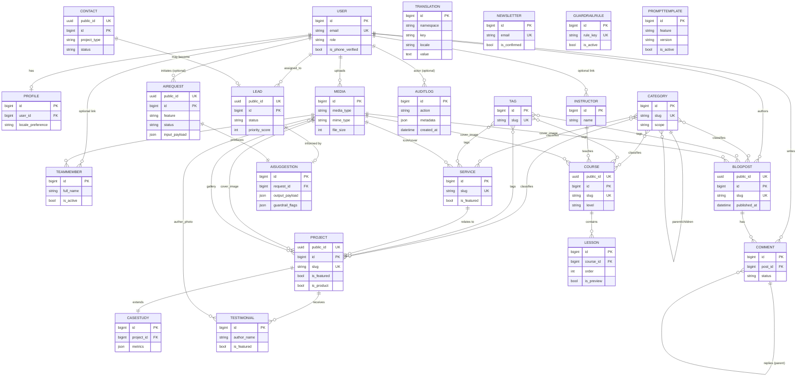

# ARCHITECTURE.md — معماری و مدل دادهٔ پروژهٔ امیت (فاز ۱)

**وضعیت:** پیش‌نویس مصوب برای شروع Implementation — منتظر تأیید نهایی مالک محصول
**ورودی این سند:** `DISCOVERY.md` (تصمیمات بنیادین فاز ۰) + پاسخ‌های مالک محصول به سؤالات فاز ۱
**خروجی این فاز:** این فایل + ERD (بخش ۴) + ۱۰ ADR در `docs/adr/`
**قانون حاکم:** تا تأیید صریح این سند، هیچ کد Implementation (مدل Django واقعی، migration، endpoint) نوشته نمی‌شود.

---

## ۰. تصمیمات ورودی از فاز ۱ (پاسخ‌های مالک محصول)

| موضوع | تصمیم |
|---|---|
| روش احراز هویت | ایمیل + رمز عبور (استاندارد Django)؛ بدون OTP برای ورود در فاز اول |
| استراتژی i18n محتوا | `django-modeltranslation` |
| موجودیت Translation عمومی | بله، لازم است (جدول key-value قابل‌ویرایش در ادمین) |
| رابطهٔ Contact/Lead | جدا از هم — Contact = ثبت خام فرم، Lead = پایپ‌لاین فروش با وضعیت |
| سیاست کامنت‌گذاری | فقط کاربر واردشده + تأیید ادمین قبل از انتشار |
| دسترسی به دوره‌های Academy | محتوای آزاد و عمومی در فاز اول؛ بدون مدل Enrollment |

این تصمیمات مستقیماً در مدل داده و ADRهای زیر اعمال شده‌اند.

---

## ۱. نمای کلی معماری سیستم

```
┌──────────────────────────┐        HTTPS/JSON         ┌───────────────────────────┐
│   Next.js (SSR) Frontend │ ─────────────────────────▶ │   Django + DRF API (v1)   │
│   apps/web (frontend/)   │ ◀───────────────────────── │   backend/                │
│   - صفحات fa (/) و en(/en)│        REST + OpenAPI      │   - Modular Monolith apps │
│   - i18n روتینگ + SEO    │                             │   - ai_engine (Guardrail) │
└──────────────────────────┘                             └──────────┬────────────────┘
                                                                     │
                                                         ┌───────────┴───────────┐
                                                         │  SQLite (dev)          │
                                                         │  MySQL 8 (production)  │
                                                         └────────────────────────┘
```

- فرانت‌اند (Next.js) و بک‌اند (Django/DRF) در یک **مونو-ریپو** نگه‌داری می‌شوند (`backend/`, `frontend/`) — ر.ک. `ADR-0001`.
- بک‌اند یک **Modular Monolith** است: یک پروژهٔ Django با چند اپ مستقل دامنه‌محور، نه میکروسرویس — ر.ک. `ADR-0002`.
- تمام فیچرهای هوش مصنوعی صرفاً از طریق اپ `ai_engine` و با ورودی Enum بسته انجام می‌شود (قانون ۱۲/۱۳/۱۴) — ر.ک. `ADR-0009`.
- روی هاست cPanel: دو پردازهٔ جدا (Django از طریق Passenger WSGI، Next.js از طریق Passenger Node.js App) پشت یک دامنه با reverse-proxy/subpath تنظیم می‌شوند؛ جزئیات دیپلوی در فاز بعدی (Deployment) مستند خواهد شد.

---

## ۲. ساختار اپ‌های Django (Modular Monolith)

```
backend/
├── manage.py
├── requirements.txt            # وابستگی‌های production
├── requirements-dev.txt        # + ابزارهای توسعه (pytest, mypy, ruff, ...)
├── config/                     # تنظیمات پروژه (نه یک «اپ» دامنه‌ای)
│   ├── settings/
│   │   ├── base.py             # مشترک
│   │   ├── dev.py              # SQLite, DEBUG=True
│   │   └── production.py       # MySQL, امنیت سخت‌گیرانه
│   ├── urls.py                 # ریشهٔ URLconf (شامل /api/v1/, /admin/, /sitemap.xml, ...)
│   ├── wsgi.py / asgi.py
│   └── celery.py (در صورت نیاز آینده؛ خالی/غیرفعال در فاز اول طبق ADR-0006)
└── apps/
    ├── core/          # زیرساخت مشترک: Mixinها، Media، Translation، AuditLog، SiteSettings
    ├── accounts/      # User سفارشی، Profile، احراز هویت
    ├── taxonomy/      # Category، Tag (قابل استفادهٔ مشترک بین چند اپ)
    ├── company/       # TeamMember، Testimonial (محتوای صفحهٔ About)
    ├── services/      # Service (صفحهٔ Services)
    ├── portfolio/     # Project، CaseStudy (صفحهٔ Projects/Pentestor/CRM)
    ├── academy/       # Course، Lesson، Instructor
    ├── blog/          # BlogPost، Comment (صفحهٔ Library)
    ├── leads/         # Contact، Lead، Newsletter
    ├── ai_engine/     # AIRequest، AISuggestion، GuardrailRule، PromptTemplate
    └── api/           # لایهٔ ترکیب: روتر DRF v1 + تنظیمات drf-spectacular (OpenAPI)
```

**قاعدهٔ مرزبندی:** هر اپ دامنه‌ای شامل `models.py`, `admin.py`, `serializers.py`, `views.py`/`viewsets.py`, `urls.py`, `services.py` (منطق کسب‌وکار خارج از view/serializer)، `translation.py` (ثبت فیلدهای مدل‌ترنسلیشن)، و `tests/` خودش است. اپ `api` هیچ مدلی ندارد و فقط URLها/روترهای اپ‌های دیگر را زیر `/api/v1/` ترکیب می‌کند. دلیل و جایگزین‌های بررسی‌شده در `ADR-0002`.

---

## ۳. فهرست کامل موجودیت‌ها به تفکیک اپ

> نماد `[i18n]` یعنی فیلد توسط `django-modeltranslation` به دو ستون `_fa`/`_en` تبدیل می‌شود. نماد `[public_id]` یعنی مدل علاوه بر PK عددی داخلی، یک `UUIDField` منتشرشونده به API عمومی دارد (جلوگیری از IDOR/حدس شناسه — رجوع به ADR-0007).

### ۳.۱ اپ `core`

| مدل | فیلدهای کلیدی | توضیح |
|---|---|---|
| `TimeStampedModel` *(abstract)* | `created_at`, `updated_at` | پایهٔ همهٔ مدل‌ها |
| `PublishableModel` *(abstract)* | `status` (draft/published/archived), `published_at` | کنترل انتشار محتوا |
| `SEOMetaModel` *(abstract)* | `meta_title[i18n]`, `meta_description[i18n]`, `og_image→Media`, `canonical_path` | رجوع به قانون ۱۷ |
| `SiteSettings` *(singleton)* | `site_name[i18n]`, `default_locale`, `contact_email`, `contact_phone`, `social_links (JSON)`, `maintenance_mode` | تنظیمات سراسری قابل‌ویرایش در ادمین |
| `Media` | `file`, `media_type` (image/document/video), `alt_text[i18n]`, `caption[i18n]`, `width`, `height`, `file_size`, `mime_type`, `checksum`, `uploaded_by→User` | منبع مرکزی فایل برای همهٔ اپ‌ها (ADR-0005) |
| `Translation` | `namespace`, `key`, `locale`, `value` (text), `is_html` (bool), `updated_by→User`, `updated_at` | رشته‌های پویای قابل‌ویرایش در ادمین، مکمل gettext (ADR-0003)؛ `unique_together=(namespace, key, locale)` |
| `AuditLog` | `actor→User` (nullable)، `action`، `target_content_type` + `target_object_id` (GenericForeignKey)، `metadata (JSON)`، `ip_address`، `user_agent`، `created_at` | رجوع به قانون ۱۶ |

### ۳.۲ اپ `accounts`

| مدل | فیلدهای کلیدی | توضیح |
|---|---|---|
| `User` *(AbstractUser سفارشی)* | `email` (USERNAME_FIELD, unique)، `phone` (nullable، برای اعلان پیامکی بعدی)، `role` (admin/editor/student/client)، `is_phone_verified` | ایمیل+رمز طبق تصمیم فاز۱؛ `phone` برای توسعهٔ آیندهٔ Kavenegar نگه داشته می‌شود |
| `Profile` | `user→User (OneToOne)`، `avatar→Media`، `bio[i18n]`، `locale_preference` (fa/en)، `job_title[i18n]`، `company_name` | اطلاعات تکمیلی |

### ۳.۳ اپ `taxonomy`

| مدل | فیلدهای کلیدی | توضیح |
|---|---|---|
| `Category` `[public_id]` | `name[i18n]`، `slug`، `parent→self` (nullable)، `scope` (choices: blog/academy/portfolio/service — محدودکنندهٔ کاربرد) | دسته‌بندی سلسله‌مراتبی قابل‌استفادهٔ مشترک |
| `Tag` | `name[i18n]`، `slug` | برچسب تخت، M2M از چند اپ |

### ۳.۴ اپ `company`

| مدل | فیلدهای کلیدی | توضیح |
|---|---|---|
| `TeamMember` `[public_id]` | `user→User` (nullable)، `full_name`، `role_title[i18n]`، `bio[i18n]`، `photo→Media`، `social_links (JSON)`، `order`، `is_active` | صفحهٔ About |
| `Testimonial` | `author_name`، `author_role[i18n]`، `author_company`، `author_photo→Media`، `quote[i18n]`، `related_project→Project` (nullable)، `is_featured`، `order` | استفاده در Home/About/Projects |

### ۳.۵ اپ `services`

| مدل | فیلدهای کلیدی | توضیح |
|---|---|---|
| `Service` `[public_id]`, Publishable, SEOMeta | `title[i18n]`، `slug`، `summary[i18n]`، `description[i18n]` (richtext)، `icon`، `categories→Category (M2M)`، `tags→Tag (M2M)`، `order`، `is_featured` | صفحهٔ Services |

### ۳.۶ اپ `portfolio`

| مدل | فیلدهای کلیدی | توضیح |
|---|---|---|
| `Project` `[public_id]`, Publishable, SEOMeta | `title[i18n]`، `slug`، `summary[i18n]`، `client_name`، `service→Service` (nullable)، `categories→Category (M2M)`، `tags→Tag (M2M)`، `cover_image→Media`، `gallery→Media (M2M)`، `year`، `is_featured`، `order` | شامل Pentestor و CRM به‌عنوان Projectهای ویژه (`is_product=True`) |
| `CaseStudy` | `project→Project (OneToOne)`، `challenge[i18n]`، `approach[i18n]`، `architecture_notes[i18n]`، `technology_stack (JSON list)`، `implementation_notes[i18n]`، `result[i18n]`، `metrics (JSON)` | تمپلیت ۷بخشی طبق بریف طراحی (Overview…Result) |

### ۳.۷ اپ `academy`

| مدل | فیلدهای کلیدی | توضیح |
|---|---|---|
| `Instructor` `[public_id]` | `user→User` (nullable)، `name`، `title[i18n]`، `bio[i18n]`، `photo→Media` | |
| `Course` `[public_id]`, Publishable, SEOMeta | `title[i18n]`، `slug`، `summary[i18n]`، `description[i18n]`، `instructor→Instructor`، `level` (beginner/intermediate/advanced)، `duration_hours`، `categories→Category (M2M)`، `tags→Tag (M2M)`، `cover_image→Media`، `is_featured`، `order` | محتوای آزاد (بدون Enrollment در فاز اول) |
| `Lesson` | `course→Course (FK)`، `title[i18n]`، `summary[i18n]`، `content[i18n]` (richtext/video_url)، `order`، `duration_minutes`، `is_preview` | ترتیب‌بندی با `order` + `unique_together=(course, order)` |

### ۳.۸ اپ `blog` *(نگاشت به بخش «Library» در IA)*

| مدل | فیلدهای کلیدی | توضیح |
|---|---|---|
| `BlogPost` `[public_id]`, Publishable, SEOMeta | `title[i18n]`، `slug`، `excerpt[i18n]`، `content[i18n]` (richtext)، `cover_image→Media`، `author→User`، `categories→Category (M2M)`، `tags→Tag (M2M)`، `reading_time_minutes`، `view_count` | |
| `Comment` | `post→BlogPost (FK)`، `author→User (FK, اجباری)`، `parent→self` (nullable، threaded)، `body`، `status` (pending/approved/rejected)، `created_at` | فقط کاربر واردشده + تأیید ادمین (تصمیم فاز۱) |

### ۳.۹ اپ `leads`

| مدل | فیلدهای کلیدی | توضیح |
|---|---|---|
| `Contact` `[public_id]` | `name`، `email`، `phone` (nullable)، `project_type` (Enum بسته)، `budget_range` (Enum بسته)، `timeline` (Enum بسته)، `message`، `source` (website_form/ai_assistant/referral)، `consent_given` (bool)، `ip_address`، `user_agent`، `created_at` | ثبت خام فرم تماس؛ فیلدهای Enum با همان لیست‌های بستهٔ مورد استفادهٔ `ai_engine` هم‌راستا هستند |
| `Lead` `[public_id]` | `contact→Contact` (nullable — ممکن است مستقیماً از AI ساخته شود)، `assigned_to→User` (nullable)، `status` (new/contacted/qualified/proposal/won/lost)، `priority_score` (int، قابل‌تنظیم توسط AISuggestion)، `ai_suggestion→AISuggestion` (nullable)، `notes`، `created_at`، `updated_at` | پایپ‌لاین فروش جدا از Contact (تصمیم فاز۱) |
| `Newsletter` | `email`، `phone` (nullable)، `locale_preference`، `is_confirmed`، `confirmation_token`، `subscribed_at`، `unsubscribed_at` | عضویت خبرنامه با Double Opt-in |

### ۳.۱۰ اپ `ai_engine`

> **وضعیت (مرور فاز ۴):** جدول‌های زیر فقط طراحی معماری‌اند و هنوز هیچ‌کدام
> پیاده‌سازی/migrate نشده‌اند. `ai_engine` رسماً به **فاز ۵** موکول شده
> (ر.ک. به‌روزرسانی انتهای `DISCOVERY.md`)؛ این بخش به‌عنوان مرجع طراحی
> برای آن فاز حفظ می‌شود، نه یک کار نیمه‌کاره از فازهای ۰ تا ۴.

| مدل | فیلدهای کلیدی | توضیح |
|---|---|---|
| `AIRequest` `[public_id]` | `feature` (Enum: lead_discovery_assistant / content_helper)، `user→User` (nullable, مهمان مجاز)، `session_id`، `locale`، `input_payload (JSON — فقط مقادیر از Enum بسته)`، `status` (pending/completed/failed/blocked_by_guardrail)، `provider`، `model_name`، `prompt_template_version`، `latency_ms`، `error_message`، `created_at`، `completed_at` | هیچ فیلد free-text برای ورودی کاربر نهایی ذخیره نمی‌شود — طبق قانون ۱۳ |
| `AISuggestion` | `request→AIRequest (OneToOne)`، `output_payload (JSON)`، `summary_text` (تولیدشده از قالب، نه خروجی خام مدل)، `confidence_score`، `guardrail_flags (JSON list)`، `is_shown_to_user` (bool)، `linked_lead→Lead` (nullable) | |
| `GuardrailRule` | `rule_key`، `description`، `rule_type` (keyword_blocklist/cultural_sensitivity/topic_restriction)، `config (JSON)`، `severity`، `is_active` | قابل‌مدیریت در ادمین بدون نیاز به دیپلوی مجدد (قانون ۱۴) |
| `PromptTemplate` | `feature`، `locale`، `version`، `template_text`، `is_active`، `created_by→User`، `created_at` | نسخهٔ اول می‌تواند با مقادیر ثابت در کد شروع شود؛ جدول از روز اول برای حسابرسی و تغییر بدون دیپلوی طراحی شده (ر.ک. ADR-0009) |

---

## ۴. ERD (Mermaid)



> توجه: فیلدهای ترجمه‌شونده (`[i18n]`) در ERD نمایش داده نشده‌اند چون `django-modeltranslation` آن‌ها را در زمان اجرا به ستون‌های `_fa`/`_en` تبدیل می‌کند؛ فهرست کامل در بخش ۳ آمده است.

---

## ۵. استراتژی i18n (جزئیات کامل در `ADR-0003`)

سه لایهٔ مجزا و مکمل:

1. **متن ثابت UI** (دکمه‌ها، برچسب‌ها، پیام‌های خطا، رابط ادمین) → **gettext استاندارد Django** (`django.po`/`django.mo` به ازای `fa` و `en`)، طبق قانون ۹. فرانت Next.js نیز از فایل پیام جداگانهٔ خودش (`next-intl` یا معادل، همگام‌سازی‌شده با همان کلیدها) استفاده می‌کند.
2. **محتوای مدل‌محور** (عنوان/توضیح Project، BlogPost، Course و...) → **`django-modeltranslation`**: فیلدهای ثبت‌شده (`title`, `summary`, ...) به‌صورت خودکار `title_fa`/`title_en` می‌شوند و بسته به زبان درخواست (`Accept-Language` یا پارامتر API) serializer مقدار مناسب را برمی‌گرداند؛ تمام ثبت‌ها اجباری هستند مگر fallback زبان صریحاً فعال شود.
3. **رشته‌های پویای قابل‌ویرایش بدون دیپلوی** (بنرها، پیام‌های موقت، متن‌های کمپین) → مدل `Translation` در `core` با کلید `(namespace, key, locale)`، قابل‌ویرایش در ادمین و کش‌شده (ر.ک. `ADR-0006`).

---

## ۶. استراتژی تاریخ شمسی/میلادی و اعداد (جزئیات در `ADR-0004`)

- تمام تاریخ/زمان‌ها در دیتابیس به‌صورت **UTC/میلادی استاندارد Django** (`DateTimeField`) ذخیره می‌شوند — هرگز شمسی در DB.
- **لایهٔ بک‌اند (Django Admin، ایمیل/پیامک اعلان):** از `jdatetime` برای نمایش تاریخ شمسی به کاربر فارسی‌زبان ادمین/اعلان استفاده می‌شود؛ یک util مشترک (`core.utils.dates.format_date(value, locale)`) این تبدیل را در یک نقطه متمرکز می‌کند.
- **لایهٔ API (DRF):** هر فیلد تاریخ هم مقدار خام ISO-8601 میلادی (برای مرتب‌سازی/ماشین) و هم یک فیلد نمایشی اختیاری (`*_display`) را که بر اساس `locale` درخواست با `jdatetime` (برای fa) یا فرمت میلادی استاندارد (برای en) تولید شده برمی‌گرداند — API به‌طور کامل بدون‌حالت و قابل کش باقی می‌ماند.
- **اعداد:** طبق قانون ۱۰، نمایش عدد فارسی (۰۱۲۳...) یک مسئولیت لایهٔ نمایش است. برای یکنواختی، util مشترک `core.utils.numerals.to_fa_digits()` هم در بک‌اند (برای فیلدهای `*_display`) و هم در فرانت (کتابخانهٔ سبک JS معادل) استفاده می‌شود تا منطق تبدیل در یک‌جا نگه‌داری شود.

---

## ۷. استراتژی Media و فایل (جزئیات در `ADR-0005`)

- ذخیره‌سازی **لوکال روی دیسک هاست** (بدون S3/CDN در فاز اول، طبق فرض محافظه‌کارانهٔ هاست).
- ساختار مسیر تاریخ‌محور: `media/{media_type}/%Y/%m/{uuid4}_{slugified-filename}.{ext}` — جلوگیری از برخورد نام فایل و افشای نام فایل اصلی حساس.
- محدودیت حجم: تصویر حداکثر ۵ مگابایت، سند حداکثر ۱۰ مگابایت، ویدیو در فاز اول فقط به‌صورت لینک خارجی (YouTube/Aparat) نه آپلود مستقیم.
- امنیت: whitelist پسوند/MIME (`jpg,png,webp,svg*,pdf,docx`؛ `svg` فقط پس از sanitize)، بررسی magic bytes (نه فقط پسوند)، نام‌گذاری مجدد فایل (بدون اجرای نام ورودی کاربر)، سرو از مسیر بدون اجازهٔ اجرای اسکریپت (`.htaccess` با `php_flag engine off` / معادل در مسیر media)، آنتی‌ویروس در صورت در دسترس بودن `clamd` روی هاست (اختیاری/best-effort).
- فایل‌های media مستقیماً توسط وب‌سرور (Apache در cPanel) سرو می‌شوند، نه از طریق پردازهٔ Django، برای کارایی.

---

## ۸. استراتژی Cache و Rate Limit (جزئیات در `ADR-0006`)

- بدون Redis/Memcached در فاز اول (طبق فرض محافظه‌کارانهٔ هاست در `DISCOVERY.md`).
- **Cache:** `django.core.cache.backends.filebased.FileBasedCache` به‌عنوان پیش‌فرض production (مشترک بین پردازه‌های Passenger، بدون سرویس اضافه)؛ `LocMemCache` فقط برای توسعهٔ محلی/تست. تنظیم از طریق env (`CACHE_BACKEND`) تا در صورت فراهم‌شدن Redis در آینده فقط با تغییر env سوییچ شود، بدون تغییر کد.
- موارد کش‌شونده: `SiteSettings`، جدول `Translation`، لیست‌های published محتوا (Service/Project/Course/BlogPost) با invalidation در `post_save`/`post_delete`.
- **Rate Limiting:** کتابخانهٔ سبک `django-ratelimit` (مبتنی بر همان cache backend، بدون نیاز به Redis) روی: فرم تماس (`Contact`)، ثبت‌نام/ورود (`accounts`)، تمام endpointهای `ai_engine` (محدودیت سخت‌گیرانه‌تر به دلیل هزینهٔ فراخوانی مدل)، و فرم خبرنامه.

---

## ۹. فرضیات مستندشده (غیرمسدودکننده، قابل‌تغییر در آینده)

این‌ها برای جلوگیری از توقف کار فرض شده‌اند؛ هر زمان مالک محصول نظر دیگری داشته باشد، بدون بازطراحی بزرگ قابل تغییرند:

1. Pentestor و CRM به‌عنوان `Project` با `is_product=True` مدل می‌شوند، نه اپ‌های جداگانه — چون در این فاز صرفاً صفحات معرفی/نمونه‌کار هستند، نه محصول SaaS فعال با ورود کاربر.
2. `PromptTemplate` و `GuardrailRule` از روز اول به‌صورت جدول دیتابیس طراحی شده‌اند (نه ثابت در کد) تا تیم بتواند بدون دیپلوی مجدد گاردریل را تنظیم کند؛ پر کردن مقادیر اولیهٔ آن‌ها بخشی از فاز Implementation اپ `ai_engine` است.
3. وابستگی‌های Python با `requirements.txt` ساده (نه Poetry) مدیریت می‌شوند تا با محیط «Setup Python App» در cPanel سازگار باشد (`ADR-0010`).
4. مدیریت داده‌های AuditLog/Contact/Lead فعلاً بدون سیاست نگه‌داری خودکار (retention policy) طراحی شده؛ تعیین دورهٔ نگه‌داری در فاز امنیت/انطباق مشخص می‌شود.
5. ایمیل همچنان به‌عنوان کانال fallback (غیرفعال پیش‌فرض) در کنار پیامک Kavenegar نگه داشته می‌شود؛ انتخاب ارائه‌دهندهٔ SMTP نهایی در فاز Notifications مشخص می‌شود.

---

## ۱۰. فهرست ADRهای این فاز

| شماره | عنوان |
|---|---|
| [ADR-0001](docs/adr/0001-overall-system-architecture.md) | معماری کلان سیستم (Next.js + Django/DRF، مونو-ریپو) |
| [ADR-0002](docs/adr/0002-django-app-boundaries.md) | مرزبندی اپ‌های Django (Modular Monolith) |
| [ADR-0003](docs/adr/0003-i18n-strategy.md) | استراتژی i18n سه‌لایه (gettext + modeltranslation + Translation) |
| [ADR-0004](docs/adr/0004-date-number-localization.md) | استراتژی تاریخ شمسی/میلادی و اعداد |
| [ADR-0005](docs/adr/0005-media-storage-strategy.md) | استراتژی ذخیره‌سازی Media |
| [ADR-0006](docs/adr/0006-caching-rate-limiting.md) | استراتژی Cache و Rate Limiting بدون Redis |
| [ADR-0007](docs/adr/0007-authentication-strategy.md) | استراتژی احراز هویت و مدل User |
| [ADR-0008](docs/adr/0008-leads-crm-pipeline.md) | مدل داده Contact/Lead/Newsletter |
| [ADR-0009](docs/adr/0009-ai-engine-data-architecture.md) | معماری دادهٔ ai_engine و Guardrail |
| [ADR-0010](docs/adr/0010-dependency-management.md) | مدیریت وابستگی‌ها و محیط اجرا (requirements.txt) |

---

## ۱۱. معیار پذیرش این فاز

- [x] ساختار اپ‌های Django بر اساس Modular Monolith تعریف شد.
- [x] تمام ۲۰ موجودیت درخواستی مدل‌سازی شدند (به‌علاوهٔ مدل‌های کمکی ضروری مثل `Profile`, `GuardrailRule`, `PromptTemplate`, `AuditLog`).
- [x] ERD در قالب Mermaid ترسیم شد.
- [x] استراتژی i18n با دلیل مشخص شد.
- [x] استراتژی تاریخ شمسی/میلادی مشخص شد.
- [x] استراتژی Media و فایل مشخص شد.
- [x] استراتژی Cache و Rate Limit مشخص شد.
- [x] ۱۰ ADR نوشته شد.
- [ ] **تأیید مالک محصول روی این سند قبل از ورود به فاز ۲ (Implementation).**

## گام بعدی

پس از تأیید این سند، فاز ۲ (Implementation اسکلت Django: اپ‌ها، مدل‌ها، migrationهای اولیه، تنظیمات SQLite محلی) با یک خلاصهٔ هدف + سؤالات ابهام (در صورت وجود) + معیار پذیرش جدید آغاز می‌شود — طبق چرخهٔ کاری پروژه و فقط در صورت درخواست صریح شما برای آن فاز.
