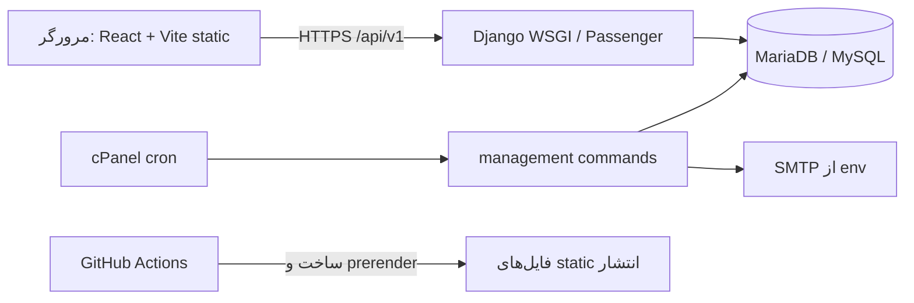

# معماری Emmett

## نمای کلان

`web/` کلاینت SPA است؛ Django زیر `/api/v1/` قرارداد عمومی و admin را فراهم می‌کند. cPanel فقط WSGI/Python App و cron دارد؛ هیچ worker بلندمدت یا Redis فرض نمی‌شود. SQLite صرفاً توسعه/آزمون است. اتصال تولیدی به MariaDB باید با `DB_ENGINE=mysql` پیکربندی شود.

## تصمیم‌ها
- [ADR-001: Django + React SPA](ADRS/0001-django-react-spa.md)
- [ADR-002: محتوا و زبان](ADRS/0002-bilingual-content.md)
- [ADR-003: Static Bridge](ADRS/0003-static-bridge.md)
- [ADR-004: cPanel](ADRS/0004-cpanel-envelope.md)
- [ADR-005: Feature modules](ADRS/0005-feature-modules.md)
- [ADR-006: Device tiers](ADRS/0006-device-tier.md)
- [ADR-007: LLM provider abstraction](ADRS/0007-llm-provider.md)
- [ADR-008: DB queue + polling](ADRS/0008-db-queue-polling.md)

## واقعیت‌های اجرا
- وضعیت عملیاتی با `GET /api/v1/health/`؛ OpenAPI در `/api/schema/` و UI در `/api/docs/`.
- Python 3.11 در sandbox برای اعتبارسنجی و Django 5.2 استفاده شد؛ هدف استقرار prompt Python 3.12 است و باید در cPanel تأیید شود.
- Worker صف فقط هنگام cron اجرا می‌شود؛ timeout بیرونی handler، لغو اجباری syscall مسدودکننده را تضمین نمی‌کند، بنابراین handlerها باید timeout داخلی محدود و درخواست‌های کوتاه داشته باشند.
